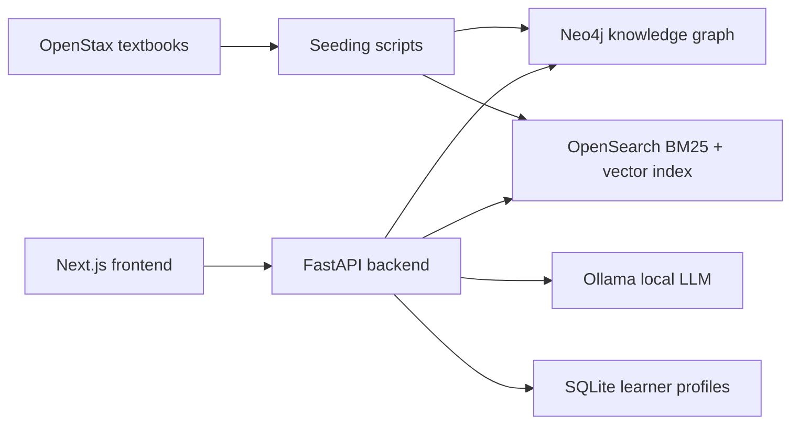

# Adaptive Knowledge Graph

A local-first AI tutor for open textbooks: knowledge-graph-enhanced retrieval
with cited answers and adaptive quizzes, running entirely on your own machine.

[](https://github.com/MysterionRise/adaptive-knowledge-graph/actions/workflows/ci.yaml)
[](LICENSE)
[](pyproject.toml)
[](.node-version)

<!-- hero image: added in the v0.3.0 release PR (#104) -->

Adaptive Knowledge Graph combines a [Neo4j](https://neo4j.com/) knowledge graph,
hybrid BM25 and vector search in [OpenSearch](https://opensearch.org/) and a
local LLM served by [Ollama](https://ollama.com/). It comes with two
[OpenStax](https://openstax.org/) textbooks, US History and Principles of
Economics, and synthetic learner profiles.

It is a **proof of concept and pilot prototype**, not a production system. See
[Project status and limitations](#project-status-and-limitations).

## Why this exists

Plain retrieval-augmented generation (RAG) returns passages that look similar
to the question. Textbooks have more structure than that: concepts build on
prerequisites and connect to related ideas, and a good answer often needs a
passage that shares no words with the question. This project explores two
ideas on top of that structure:

- **Knowledge-graph-enhanced RAG.** Concepts and their relationships are
  extracted from each book into Neo4j. Before retrieval, the question is
  expanded with neighbouring concepts from the graph, and every answer cites the
  passages it used. An evaluation harness measures whether the expansion
  actually helps.
- **Adaptive practice.** Quizzes are generated from the same passages, and a
  Bayesian Knowledge Tracing (BKT) model updates per-concept mastery after each
  answer so the next quiz targets a suitable difficulty.

Everything runs **local-first**. With the default `PRIVACY_LOCAL_ONLY=true`,
questions, learner data and textbook excerpts never leave your machine, which
matters for education data.

## Features

- **Cited answers.** Answers are grounded in retrieved passages with numbered
  citations, source snippets, the expanded concepts and the textbook
  attribution. They can be streamed token by token over server-sent events.
- **Knowledge graph explorer.** Concepts, modules and chunks live in Neo4j with
  `PREREQ`, `RELATED` and `COVERS` relationships. The UI shows them in an
  interactive Cytoscape.js graph, and the API serves prerequisite chains and
  learning paths.
- **Hybrid retrieval.** OpenSearch BM25 and kNN search over
  [BGE-M3](https://huggingface.co/BAAI/bge-m3) embeddings are fused with
  reciprocal rank fusion. A cross-encoder reranker is available as an option.
- **KG versus plain comparison.** A side-by-side page shows what graph
  expansion changes for the same question.
- **Adaptive quizzes.** The LLM generates multiple-choice questions at a
  difficulty that follows the learner's mastery. BKT updates mastery after each
  answer, and recommendations point to prerequisites to review or topics to
  explore next.
- **Multiple subjects.** Each subject in
  [`config/subjects.yaml`](config/subjects.yaml) has its own graph labels,
  search index, prompts, theme and attribution. US History and Economics are
  seeded by default.
- **Evaluation harness.** A golden set of 53 questions compares KG-expanded
  retrieval with plain retrieval. See [Evaluation](#evaluation).
- **Operational basics.** Dependency-aware readiness checks, request IDs,
  response-time headers, rate limits and an optional production mode that
  enforces an API key.

## Architecture



| Path | Contents |
| --- | --- |
| [`frontend/`](frontend/) | Next.js app: chat, graph explorer, comparison, assessment and demo status pages |
| [`backend/app/api/routes/`](backend/app/api/routes/) | FastAPI routes under `/api/v1`: `ask`, `quiz`, `student`, `graph`, `learning-path`, `subjects`, `demo` |
| [`backend/app/`](backend/app/) | Retrieval (`rag/`), graph access (`kg/`), embeddings, concept extraction and the LLM client (`nlp/`), quizzes and the learner model (`student/`) |
| [`scripts/`](scripts/) | Ingestion, knowledge-graph build, indexing and evaluation |
| [`config/subjects.yaml`](config/subjects.yaml) | Subject definitions: books, prompts, indices, theme, attribution |
| [`infra/compose/`](infra/compose/) | Docker Compose stack for Neo4j, OpenSearch and the optional API containers |

[docs/ARCHITECTURE.md](docs/ARCHITECTURE.md) covers the request flows, data
boundaries, security model and trade-offs in more detail.

## How a question is answered

`POST /api/v1/ask` and the streaming `POST /api/v1/ask/stream` share one
pipeline:

1. **Resolve the subject** from `config/subjects.yaml` (`us_history` by
   default). An unknown subject returns `404`.
2. **Expand the question with the knowledge graph.** spaCy named-entity
   recognition and YAKE keyword extraction find concepts in the question. They
   are matched against the subject's concepts in Neo4j, and neighbours within
   `RAG_KG_EXPANSION_HOPS` (default 1) are added to the query. If Neo4j is
   unavailable, the pipeline continues without expansion.
3. **Retrieve with hybrid search.** OpenSearch runs a BM25 query over chunk
   text, titles and key terms and a kNN query over BGE-M3 embeddings, then
   merges both rankings with reciprocal rank fusion (RRF). Set
   `RETRIEVAL_MODE=knn` for vector search only.
4. **Rerank (optional).** With `RERANKER_ENABLED=true` the retriever fetches
   `RAG_RETRIEVAL_TOP_K` candidates (20 by default) and the
   `BAAI/bge-reranker-v2-m3` cross-encoder keeps the best `top_k`. Window
   retrieval, which adds neighbouring chunks, is also opt-in; see
   [docs/ARCHITECTURE.md](docs/ARCHITECTURE.md).
5. **Generate a cited answer.** Ollama (`llama3.1:8b-instruct-q4_K_M` by
   default) answers from a subject-specific prompt that restricts it to the
   retrieved context and asks it to cite passages as `[1]`, `[2]`. The response
   carries the answer, the sources with scores, the expanded concepts, the model
   and the OpenStax attribution. The API returns `503` when the LLM is
   unreachable and `502` when it produces an empty or invalid answer.

## Hardware requirements

Approximate memory use of the full local stack:

| Component | RAM |
| --- | --- |
| Neo4j | 3.5–4 GB |
| OpenSearch | 1.5–2 GB |
| Ollama with `llama3.1:8b-instruct-q4_K_M` | 5.5–6.5 GB |
| API process (PyTorch, BGE-M3) | 3–4 GB |
| Next.js development server | 0.5–1 GB |
| **Total** | **about 14–17.5 GB** |

- **Memory:** 16 GB RAM minimum, which is tight (close other applications);
  32 GB recommended.
- **Disk:** about 20 GB free for Docker images, the Ollama model, the BGE-M3
  download (about 2.3 GB) and the indices.
- **GPU:** optional. `EMBEDDING_DEVICE=auto` uses CUDA or Apple Silicon (MPS)
  when available and falls back to CPU.
- **Time:** the first seed downloads the embedding model and embeds about
  19,000 chunks. On CPU this takes tens of minutes.

## Quickstart

### 1. Install the prerequisites

| Tool | Version |
| --- | --- |
| Python | 3.11, 3.12 or 3.13 |
| [Poetry](https://python-poetry.org/docs/#installation) | 2.x |
| [Node.js](https://nodejs.org/) | 24 LTS (pinned in [`.node-version`](.node-version)) |
| Docker with Compose v2 | Docker Desktop or Docker Engine |
| [Ollama](https://ollama.com/download) | current release |
| Git and GNU Make | any recent version |

Then pull the local model once (about 4.9 GB):

```bash
ollama pull llama3.1:8b-instruct-q4_K_M
```

### 2. Clone and bring up the stack

```bash
git clone https://github.com/MysterionRise/adaptive-knowledge-graph.git
cd adaptive-knowledge-graph
make quickstart
```

`make quickstart` installs the Python dependencies, checks that Ollama and the
model are available, starts Neo4j and OpenSearch with
`docker compose up -d --wait`, seeds US History and Economics, and prints the
next steps. If a prerequisite is missing it stops with a message; run
`make doctor` to see the state of every dependency.

### 3. Start the API

```bash
make run-api
```

The API listens on <http://localhost:8000>. In development mode the interactive
API docs are at <http://localhost:8000/docs>.

### 4. Start the frontend

In a second terminal:

```bash
cd frontend
npm ci
npm run dev
```

Open <http://localhost:3000>. Try asking "What was the Stamp Act and how did it
lead to colonial resistance?" in **Chat**, click around the **Graph**, then
generate a quiz in **Assessment**.

### Everyday commands

| Command | What it does |
| --- | --- |
| `make doctor` | Check the local environment and report what is missing |
| `make up` / `make down` | Start or stop the Docker services |
| `make seed` | Seed US History and Economics into Neo4j and OpenSearch |
| `make run-api` | Run the API with auto-reload on port 8000 |
| `make test` | Run the backend test suite with coverage |
| `make demo-eval` | Run the evaluation against the running API |
| `make help` | List every target |

Local service URLs: Neo4j Browser <http://localhost:7474> (development login
`neo4j` / `password`), OpenSearch <http://localhost:9200>, Ollama
<http://localhost:11434>.

### Troubleshooting

- **Start with `make doctor`.** It reports missing tools, stopped services and
  a missing model.
- **Ollama is unreachable or the model is missing.** Start Ollama
  (`ollama serve` or the desktop app), check `ollama list`, and pull the model
  again. If Ollama runs elsewhere, set `LLM_OLLAMA_HOST`.
- **A container exits or the machine starts swapping.** Neo4j and OpenSearch
  need 5–6 GB together. Give Docker Desktop more memory and close other
  applications.
- **Answers say no relevant content was found, or the graph is empty.** Seeding
  did not finish. Run `make seed` again and watch for errors.
- **`/health/ready` returns `503`.** Neo4j or OpenSearch is down. Run `make up`.
- **The API refuses to start because of `PRIVACY_LOCAL_ONLY`.** Remote LLM
  modes need `PRIVACY_LOCAL_ONLY=false`. See [Configuration](#configuration).
- **`npm ci` fails with an engine error.** Switch to Node 24, for example with
  `fnm use` (it reads `.node-version`) or `nvm install 24`.
- **A port is already in use.** The stack uses 3000 (frontend), 8000 (API),
  7474 and 7687 (Neo4j), 9200 (OpenSearch) and 11434 (Ollama).

## Configuration

The API reads settings from environment variables or from a `.env` file in the
repository root. Defaults work for local development; to change them, copy
[`.env.example`](.env.example) to `.env`. The settings you are most likely to
need:

| Variable | Default | Effect |
| --- | --- | --- |
| `APP_ENV` | `development` | `development` runs without an API key and logs a warning at startup. `production` refuses to start without `API_KEY`, turns off `/docs`, `/redoc` and `/openapi.json` unless `API_DOCS_ENABLED=true`, and restricts the allowed CORS methods. |
| `API_KEY` | empty | Required in production. Clients send it in the `X-API-Key` header. |
| `PRIVACY_LOCAL_ONLY` | `true` | Keeps every LLM call on the local Ollama. While it is `true` the API refuses to start unless `LLM_MODE=local`. |
| `LLM_MODE` | `local` | `local` uses Ollama. `remote` uses OpenRouter (`OPENROUTER_API_KEY`). `hybrid` tries Ollama and falls back to OpenRouter. Both remote modes send questions and retrieved excerpts to the provider and require `PRIVACY_LOCAL_ONLY=false`. |
| `EMBEDDING_DEVICE` | `auto` | `auto` picks `cuda`, then `mps`, then `cpu`. Set a device to override. |
| `LLM_LOCAL_MODEL` | `llama3.1:8b-instruct-q4_K_M` | Ollama model tag. |
| `LLM_OLLAMA_HOST` | `http://localhost:11434` | Ollama URL. |
| `RETRIEVAL_MODE` | `hybrid` | `hybrid` (BM25 + kNN with RRF) or `knn`. |
| `RERANKER_ENABLED` | `false` | Enables the cross-encoder reranker. The model downloads on first use. |
| `STUDENT_BKT_ENABLED` | `true` | BKT mastery updates; `false` switches to a simple linear update. |

Every setting is defined in
[`backend/app/core/settings.py`](backend/app/core/settings.py). The frontend
reads `NEXT_PUBLIC_API_URL` (default `http://localhost:8000`) and the optional
`NEXT_PUBLIC_API_KEY`; see [`frontend/README.md`](frontend/README.md). Values
prefixed with `NEXT_PUBLIC_` end up in the browser bundle, so read
[SECURITY.md](SECURITY.md) before you rely on an API key.

## Evaluation

[`scripts/evaluate_rag.py`](scripts/evaluate_rag.py) sends each question in the
golden set ([`data/evals/golden_qa.yaml`](data/evals/golden_qa.yaml): 27 US
History and 26 Economics cases) to a running API twice, with and without
knowledge-graph expansion. It reports answer term recall, citation hit rate,
expected-source MRR, how often questions the book cannot support are refused,
and latency. The set mixes answerable questions with cross-chapter synthesis,
ambiguous and conflicting-source questions, unsupported claims and
prompt-injection attempts.

```bash
make demo-eval   # run the evaluator, then check that the report is valid
```

The report is written to [`docs/evals/`](docs/evals/). It only counts as
evidence when `environment_valid` is `true`, that is, when it ran against a
live, seeded stack.

<!-- eval table: filled in the release PR (#104) -->

The metrics are heuristic (keyword and source-title matching). They are meant
for regression tracking, not as a benchmark; see
[docs/evals/README.md](docs/evals/README.md).

## Project status and limitations

This is a proof of concept and pilot prototype. Known limitations:

- **No identity or tenancy.** Learner profiles are selected by a `student_id`
  parameter; there are no user accounts or roles
  ([#73](https://github.com/MysterionRise/adaptive-knowledge-graph/issues/73)).
- **No server-side grading.** Quiz answers are sent to the browser and graded
  there ([#74](https://github.com/MysterionRise/adaptive-knowledge-graph/issues/74)).
- **Heuristic evaluation.** The metrics come from keyword and source matching
  on a 53-question golden set, not from human review.
- **Uncalibrated learner model.** BKT runs with fixed parameters (transit 0.1,
  slip 0.1, guess 0.25, initial mastery 0.3) that were not fitted to learner
  data, and question difficulty is estimated by the LLM. There is no item
  response theory (IRT) model.
- **No LMS integration.** There is no LTI or gradebook support.
- **Two seeded subjects.** Biology and World History are configured but not
  seeded yet
  ([#75](https://github.com/MysterionRise/adaptive-knowledge-graph/issues/75)).
- **LLM answers can be wrong.** Citations make answers checkable; they do not
  make them correct.

## Documentation

| Document | Contents |
| --- | --- |
| [docs/ARCHITECTURE.md](docs/ARCHITECTURE.md) | Request flows, data boundaries, security model, trade-offs |
| [docs/TESTING.md](docs/TESTING.md) | Test suites, markers and commands |
| [docs/COMPLIANCE.md](docs/COMPLIANCE.md) | Content licensing, privacy and data handling |
| [docs/evals/README.md](docs/evals/README.md) | Evaluation harness and report format |
| [docs/demo/README.md](docs/demo/README.md) | Scripted demo workflow, presenter scripts and slides |
| [docs/archive/tribunal-2026-02/](docs/archive/tribunal-2026-02/README.md) | Archived adversarial code review |
| [ROADMAP.md](ROADMAP.md) | What is planned next |
| [CHANGELOG.md](CHANGELOG.md) | Notable changes |
| [SECURITY.md](SECURITY.md) | Reporting vulnerabilities, threat model, hardening |

## Roadmap

Planned work, from evidence and hardening to identity and assessment
integrity, is described in [ROADMAP.md](ROADMAP.md) and tracked in
[GitHub issues](https://github.com/MysterionRise/adaptive-knowledge-graph/issues).

## Contributing

Contributions are welcome. Read [CONTRIBUTING.md](CONTRIBUTING.md) for the
development setup, quality gates and pull request process, and pick one of the
[good first issues](https://github.com/MysterionRise/adaptive-knowledge-graph/issues?q=is%3Aissue+is%3Aopen+label%3A%22good+first+issue%22).
Questions and ideas go to
[GitHub Discussions](https://github.com/MysterionRise/adaptive-knowledge-graph/discussions);
see [SUPPORT.md](SUPPORT.md) for where to ask what. Everyone taking part is
expected to follow the [Code of Conduct](CODE_OF_CONDUCT.md).

## Citation

If you use this project in research or teaching material, please cite it. The
metadata is in [CITATION.cff](CITATION.cff), and GitHub's "Cite this
repository" button produces APA and BibTeX from it.

```bibtex
@software{perikov_adaptive_knowledge_graph,
  author  = {Perikov, Konstantin},
  title   = {Adaptive Knowledge Graph},
  url     = {https://github.com/MysterionRise/adaptive-knowledge-graph},
  license = {MIT}
}
```

## License and attribution

The code is released under the [MIT License](LICENSE).

Textbook content comes from [OpenStax](https://openstax.org/) and is licensed
under [CC BY 4.0](https://creativecommons.org/licenses/by/4.0/). Every answer
carries the attribution of its source book; [NOTICE](NOTICE) lists the books,
the changes made to them and the trademark notice. This project is not
affiliated with, sponsored by or endorsed by OpenStax or Rice University.
