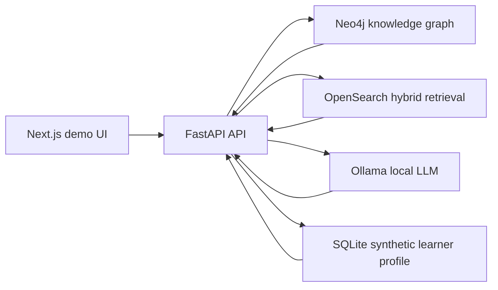

# Adaptive Knowledge Graph: Client Demo Brief

## What It Demonstrates

Adaptive Knowledge Graph is a controlled local demo for education clients who
need AI over approved learning content. It combines KG-aware retrieval,
traceable citations, graph exploration, adaptive practice, and live evaluation
signals.

## Why It Matters

Generic AI tutors can answer fluently without giving publishers, institutions,
or authors enough control. This prototype focuses on reviewability:

- answers cite approved source material
- concepts and prerequisites are inspectable
- learner practice adapts to mastery state
- unsupported and adversarial questions are measured in evals
- the local-first demo avoids real student PII

## Demo Modules

- Grounded Q&A with citations.
- Knowledge graph exploration.
- KG-RAG vs plain retrieval comparison.
- Adaptive quiz and mastery update.
- Client demo status dashboard.
- Golden-set evaluation report.

## Architecture Snapshot

## Pilot Path

Recommended first pilot:

- 4-6 weeks
- one course/module
- approved content only
- synthetic or consented users
- human review of generated questions
- evaluation report covering groundedness, refusal behavior, and latency

## Current Boundaries

This is not yet:

- production certification infrastructure
- FERPA/COPPA/GDPR certified
- LMS/LTI integrated
- psychometrically calibrated
- a proctoring or credentialing product

## Next Conversation

The next client discussion should choose one content slice, define acceptable
source-use policy, select reviewer roles, and agree on pilot success metrics.
