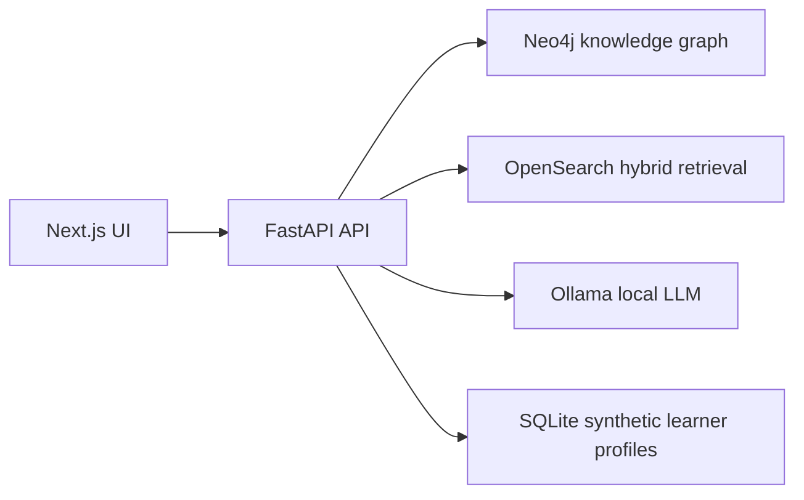

# Adaptive Knowledge Graph: Project Brief

A one-page summary to hand out after a demo.

## What it is

Adaptive Knowledge Graph is a local prototype for AI over approved learning
content. It combines KG-aware retrieval, traceable citations, graph
exploration, adaptive practice and live evaluation signals. The demo runs on
OpenStax textbooks and synthetic learners.

## Why it matters

Generic AI tutors can answer fluently without giving content owners,
institutions or authors enough control. This prototype focuses on
reviewability:

- answers cite approved source material
- concepts and prerequisites can be inspected
- practice adapts to each learner's mastery
- unsupported and adversarial questions are measured in the evaluation
- the local-first setup avoids real student data

## What the demo covers

- Grounded Q&A with citations.
- Knowledge graph exploration.
- KG-RAG versus plain retrieval comparison.
- Adaptive quiz and mastery updates.
- A demo readiness dashboard.
- A golden-set evaluation report.

## Architecture snapshot

## A possible pilot

- 4–6 weeks
- one course or module
- approved content only
- synthetic or consented users
- human review of generated questions
- an evaluation report on groundedness, refusal behaviour and latency

See the [pilot outline](CLIENT_PILOT_PROPOSAL.md) for details.

## Current boundaries

It is designed so learner data stays on the machine, but it has no compliance
certification (for example under FERPA, COPPA or GDPR). It is also not yet:

- production certification infrastructure
- integrated with an LMS or LTI
- psychometrically calibrated
- a proctoring or credentialing product

## Next steps

A follow-up conversation would pick one content slice, agree on a source-use
policy, choose reviewer roles and set pilot success metrics.

The code is open source under the MIT License:
<https://github.com/MysterionRise/adaptive-knowledge-graph>
